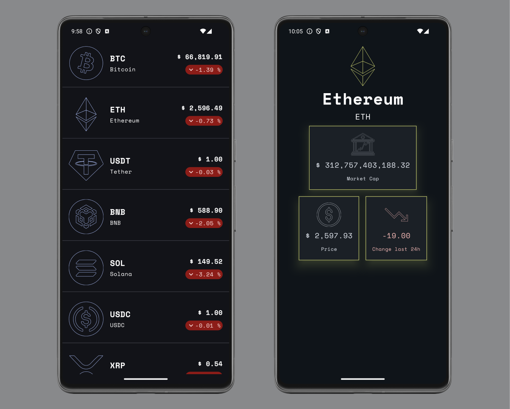
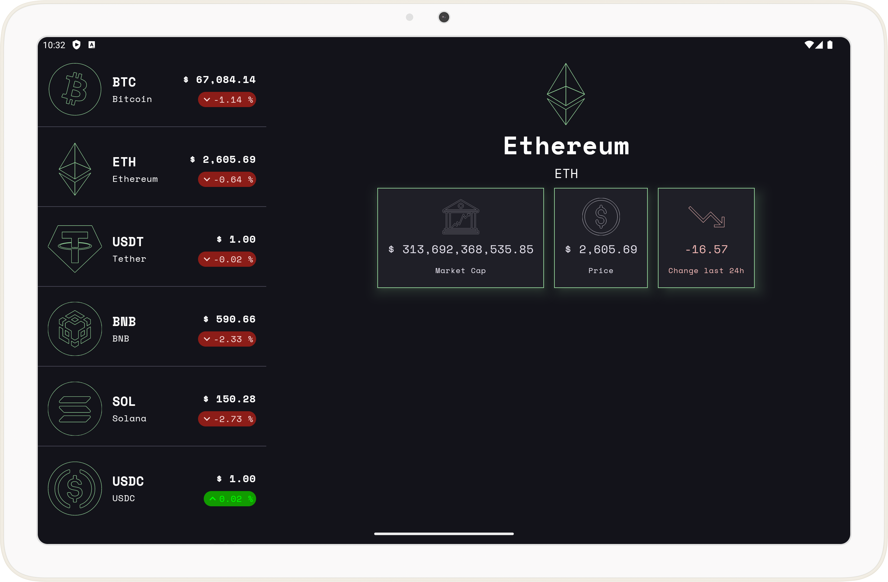

# 📱 Crypto Tracker

**Welcome to Crypto Tracker!**  
This app is designed to help users stay updated on cryptocurrency prices, displaying a list of
currencies along with their current values and recent changes.

## 🛠️ Technologies Used

Crypto Tracker is built with modern, efficient, and scalable technologies to ensure both high
performance and maintainability:

- **Kotlin**  — Primary language for concise and expressive code.
- **MVI**  — Architecture for clear separation of concerns.
- **Clean Architecture**  — Ensures maintainability and scalability.
- **Jetpack Compose**  — Declarative UI toolkit for building interfaces.
- **Koin**  — Lightweight dependency injection framework.
- **Material 3 with Dynamic Color**  — Modern design components for UI. write some crap about
  dynamic color.
- **Coroutines & Flows**  — Handles asynchronous tasks and reactive data.
- **Adaptive Layouts** — Optimizes the UI for tablets, foldables, and larger screens.

## 🚀 How to Run the Project

1. Clone the repository:
   `git clone https://github.com/pavel-maiseichyk/CryptoWallet.git`
2. Open the project in Android Studio.
3. Run the app on an Android device or emulator.

## 📸 Screenshots

## 📝 License

This project is licensed under the CC BY-NC 4.0 License - see the [LICENSE](LICENSE.txt) file for
details.